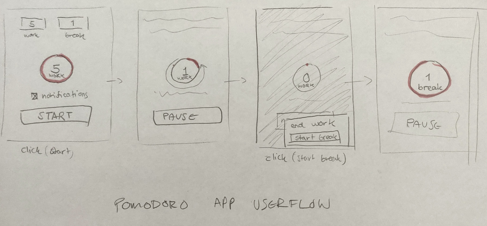

# PWA-den-valgfrie-opgave

## [Pomodoro App](https://pomodoro.isabroch.dk)
Hostede hos Netlify.

   

# Formål:

Opgaven har til formål at, demonstrere at **koncepterne fra PWA undervisningen** kan anvendes i praksis i fremstillingen at et produkt.

# Projektet skal indeholde følgende

**Indledende opgave** 
_Du skal ikke bruge yderligere tid på at forfinde disse. Du har allerede lavet dem, aflever dem som de er!_

1. Et udfyldt **koncept** (den udleverede pdf)
2. En 'feature-liste' hvor **main feature** er fremhævet
3. Et illustreret **userflow** for main feature ex. (find sko, køb sko, følg ordre, modtag ordre)

**Koncepterne fra PWA undervisningen**

1. Custom install UI element
2. Pre-cache (The App Shell Model)
3. Generic Fallback (Custom offline side)

**Målpinde**

1. Appen skal implementerere **funktionaliteter** fra enheden ex. viberation, notifikation, GPS etc.
2. Der skal i appen implementeres **eksterne data** via netværk.
3. Appen skal distribueres over HTTPS (Nemt opsætteligt og gratis på Netlify)

# Produktet(MVP) skal udvikles som PWA

Projektet **SKAL** opfylde kriterierne for en **PWA**. Brug **Lighthouse** rapporterne som hjælp.
Dit projekt skal derfor integreres med:

1. Et **Manifest**
2. En **Serviceworker**

   

# Svar fra Isabella

## App Koncept

Et produktivitet app baseret på konceptet af **Pomodoro Timer**.

### Userflow:

1. Start screen with work timer. User opts in to notifications. 
   _User clicks 'start' button and timer begins._

2. Timer runs, with option to pause timer. 
   _Timer ends at 0_

3. If user is opted in for notification, platform sends a notification that timer has ended, with button on notification to start next timer. 
   If user doesn't want notifications, 'pause/start' button is replaced with 'start next timer' button on app. 
   _User clicks 'start next timer'._

4. Timer info swaps to next phase (i.e. break) settings and starts running until user stops triggering 'next timer' action.

### Funktionaliteten

- To fase: Arbejde tid (default 25 min.) og pause tid (default 5 min.)
- Fasetiden kan tilpasses.
- Man starter på arbejde tid.
- Når timer er færdig få man notification, lyd, og vibration.
- Efter en fase tid er færdig, man 'confirmere' det og så starter næste fase.
- Der er følgende funktionaliteten i kanppen:
  - Når timer ER IKKE aktiv:
    - **Start** ville begynde med nuværende fase
    - **Skip** ville gå direkte til næste fase
  - Nar timer ER aktiv:
    - **Pause** ville pause timer på aktuelle tidspunkt
    - **Reset** ville ryd timer og nulstil til begyndelse af arbejde tid

### Teknologi

Jeg har valgt at bygge appen med [React](http://reactjs.org/) og [Parcel](https://parceljs.org/), da jeg allerede har et template for hvordan et projekt med de to tools kan bygges. Så kan jeg fokusere helt på at bygge funktionaliteten.

Jeg har også valgt at brug [Moment.js](https://momentjs.com/) for de tidsstempler.
